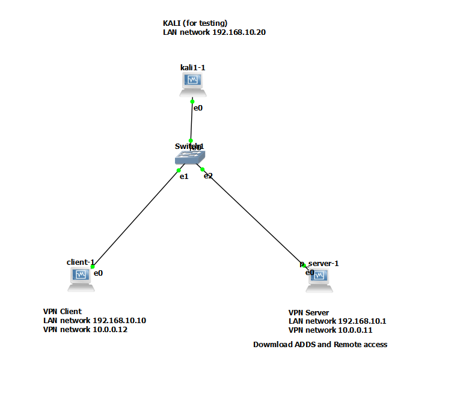

# 🛡️ Offline VPN Project using GNS3 & VirtualBox

This project demonstrates a secure **Offline VPN** setup between a Windows Server and Windows Client using **PPTP**, all simulated in **GNS3** and **VirtualBox**. A **Kali Linux attacker** is also added to observe network behavior without decrypting the traffic.

---

## 🔧 Topology Overview

- **VPN Server**
  - LAN: `192.168.10.1`
  - VPN: `10.0.0.11`

- **VPN Client**
  - LAN: `192.168.10.10`
  - VPN: `10.0.0.12`

- **Attacker (Kali)**
  - LAN: `192.168.10.20`

---

## 🛠️ Tools Used

- [GNS3](https://www.gns3.com/) – Network simulation software used to design and run the VPN topology
- [VirtualBox](https://www.virtualbox.org/) – Virtualization platform to run Windows and Kali Linux machines
- [Windows Server](https://www.microsoft.com/en-us/windows-server) – Used to configure the VPN Server
- [Kali Linux](https://www.kali.org/) – Used as an attacker machine to test VPN encryption
- [Wireshark](https://www.wireshark.org/) – (Optional) Used for packet analysis and verifying VPN encryption

---

## 🎯 Project Goals

- Set up a **PPTP VPN** in an isolated lab.
- Demonstrate secure communication between client and server.
- Simulate a **Kali attacker** capturing encrypted packets.
- Prove **encryption effectiveness** via packet analysis.

---

## 📂 Files Included

- `.gns3` project file
- Configuration folder
- Topology image (`topology.png`)

--## 🗂️ Project Files

- [/configs/server_vpn_config.txt](https://github.com/jatin-rajputt/offline-vpn/blob/main/configs/windows-vpn-server-setup.txt): VPN settings on Windows Server
- [/configs/client_settings.txt](https://github.com/jatin-rajputt/offline-vpn/blob/main/configs/windows-vpn-client-setup.txt): Windows Client VPN connection info
-[ /configs/kali_ping_capture.txt](https://github.com/jatin-rajputt/offline-vpn/blob/main/configs/kali-testing-commands.txt) : Wireshark capture from Kali (encrypted traffic)

## 📸 Screenshots

The folder `screenshoots/` contains step-by-step screenshots of the project:
- VPN configuration on the Server and Client
- Communication testing
- Packet capture from the Attacker
- Successful VPN connection

## 📌 Status

✅ Project Completed  
🔄 Currently uploading documentation

---

> Made by [Jatin Rajput](https://github.com/jatin-rajputt)

